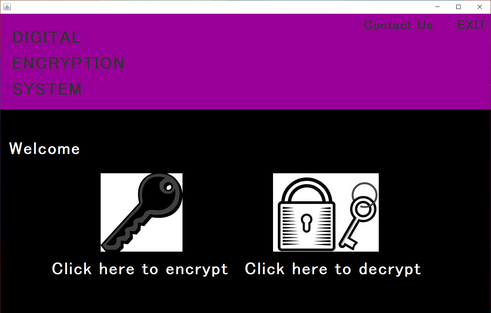
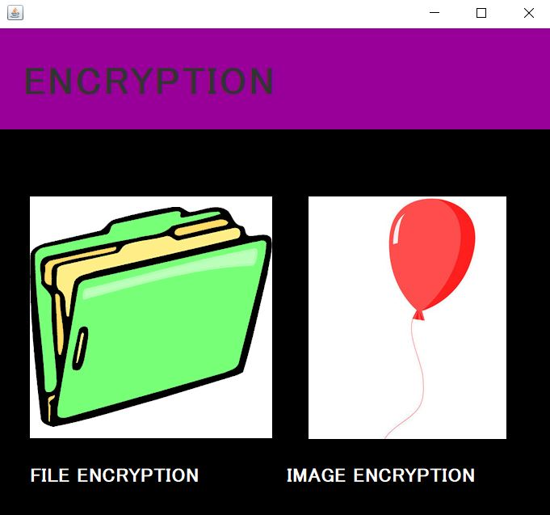
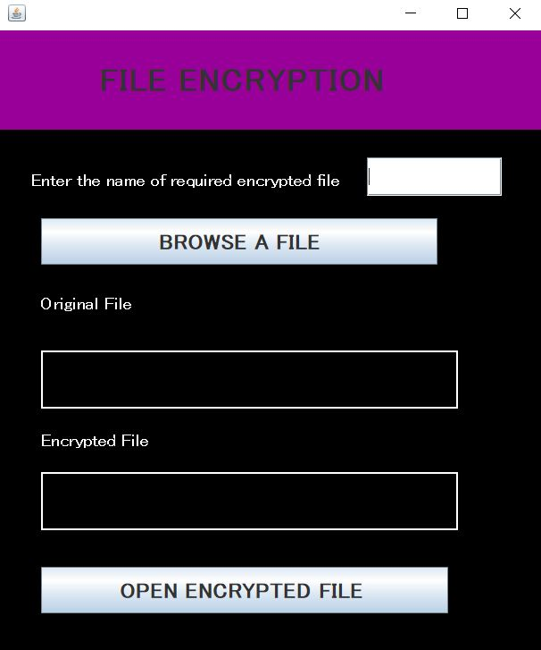
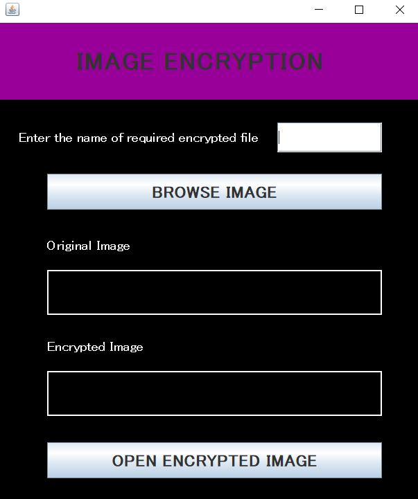
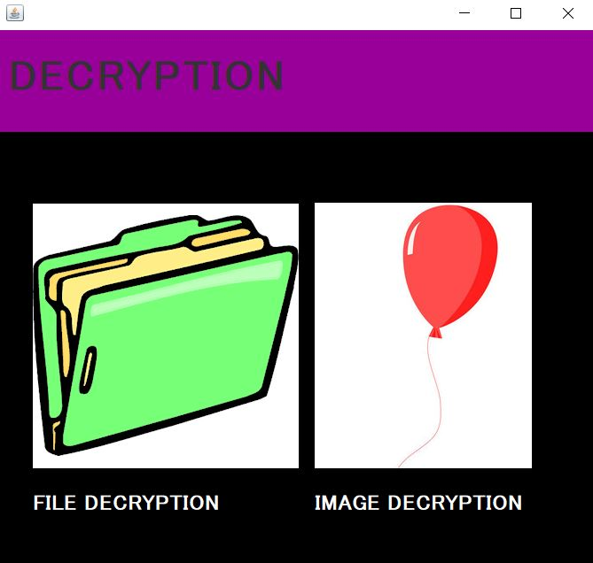
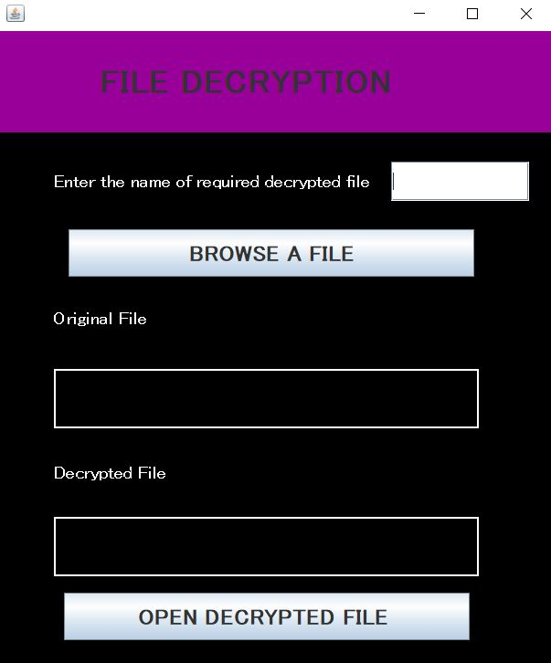
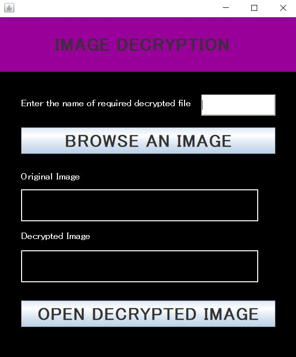

# DIGITAL-ENCRYPTION-STANDARD
DES is a block cipher algorithm in which we will have to use same key for encryption and decryption. In this project,  we will use Java DES implementation to encrypt and decrypt a file and image. 

Language Used - Java Core

Concept Used - Swing

IDE Used - Netbeans

